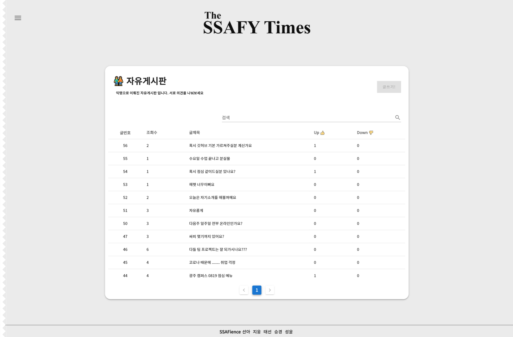
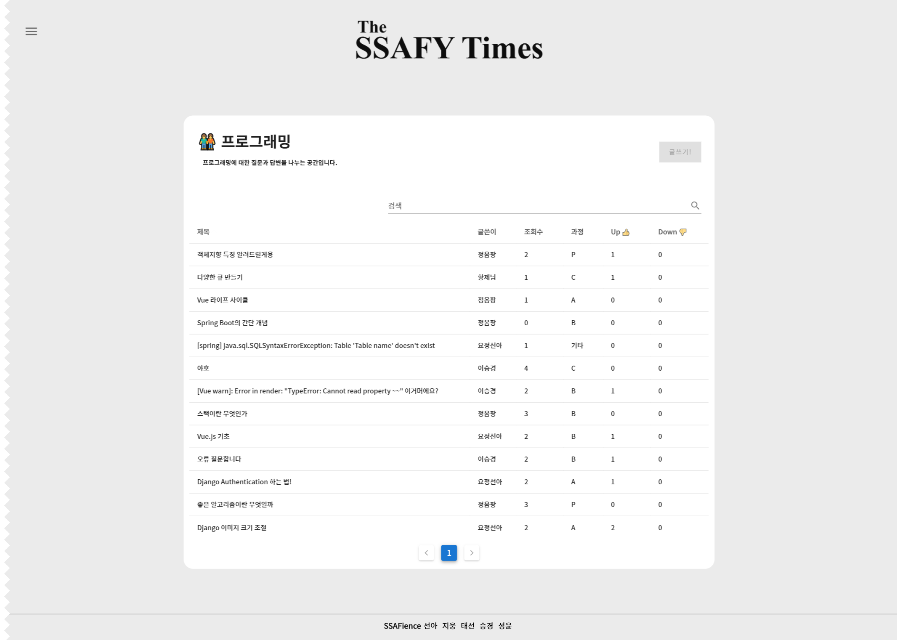
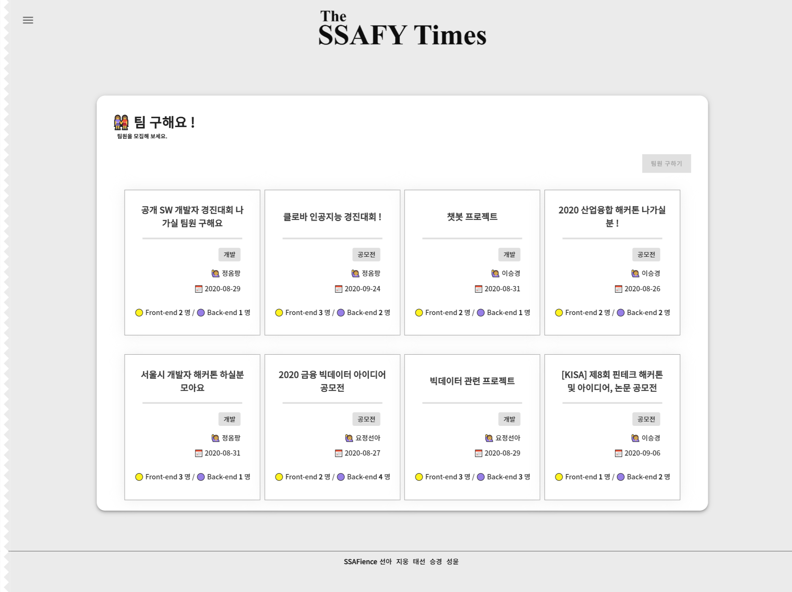

## 💛 [PROJECT](###▶ 처음으로)


- ####  The SSAFY Times

  > [COVID-19 ](https://ko.wikipedia.org/wiki/%EC%BD%94%EB%A1%9C%EB%82%98%EB%B0%94%EC%9D%B4%EB%9F%AC%EC%8A%A4%EA%B0%90%EC%97%BC%EC%A6%9D-19)이후 비대면으로 학습이 이루어짐에 따라 우리 Ssafience팀은  SSAFY인에게 개발과 학습에 있어서 어려운 점을 도와주고자 커뮤니티를 제공하는 서비스인 `The SSAFY Times`를 제작했습니다.

- #### 기능 

  1. 자유게시판 : 익명으로 된 자유 게시판을 활용하여 SSAFY인들과 다양한 의견을 나눠 보세요.

     

  2. 프로그래밍 게시판 : SSAFY인과 개발하다가 어려웠던 부분들을 코드로 공유하면서 나눠 보세요.

  3. 팀 구하기 : 각종 공모전, 개발, 프로젝트 등 팀원을 구할 때 SSAFY에서 팀을 구할 수 있습니다.

  4. 나만의 기사 작성: 기자가 되어 IT 소식을 알려보세요 !  

  5. SSAFY Times : 매 달 Hot한 게시물과 다양한 소식들을 저널로 만나 볼 수 있습니다. 


## 📌 설치 방법 (Installation)

#### Install using npm

```
npm install
```

#### Start Project

``` 
npm run serve
```


## 📌 기술 스택

> Vue.js
>
> Spring-Boot
>
> MariaDB
>
> Spring-Boot
>
> Docker
>
> Vuetify
>
> Rest_api server
>
> Swagger
>
> Maven


## 📌 Release

- [v1.0](https://lab.ssafy.com/s03-webmobile1-sub2/s03p12c208/tags)


## ➕ 추가 정보

- [The SSAFY Times 기획](https://docs.google.com/document/d/1HFM2kgkNdIB2Q2QQijNZSI0izEAWCcPpdOeNH_wLdxs/edit)
- [API 문서](https://lab.ssafy.com/s03-webmobile1-sub2/s03p12c208/wikis/API-DOC)
- [Wiki](https://lab.ssafy.com/s03-webmobile1-sub2/s03p12c208/wikis/home)
- [Json 형식](https://docs.google.com/document/d/15x3Shy94fT7h7KNCzDGx8KJs36B3GXvw1LdzyoHw2iU/edit)
- [WireFrame](https://lab.ssafy.com/s03-webmobile1-sub2/s03p12c208/wikis/WireFrame-%EC%9D%B4%EB%AF%B8%EC%A7%80)
- [ERD Diagram](https://lab.ssafy.com/s03-webmobile1-sub2/s03p12c208/wikis/%EB%8D%B0%EC%9D%B4%ED%84%B0-%EB%B2%A0%EC%9D%B4%EC%8A%A4)


## 💛 TEAM Ssafience


### ▶ 처음으로